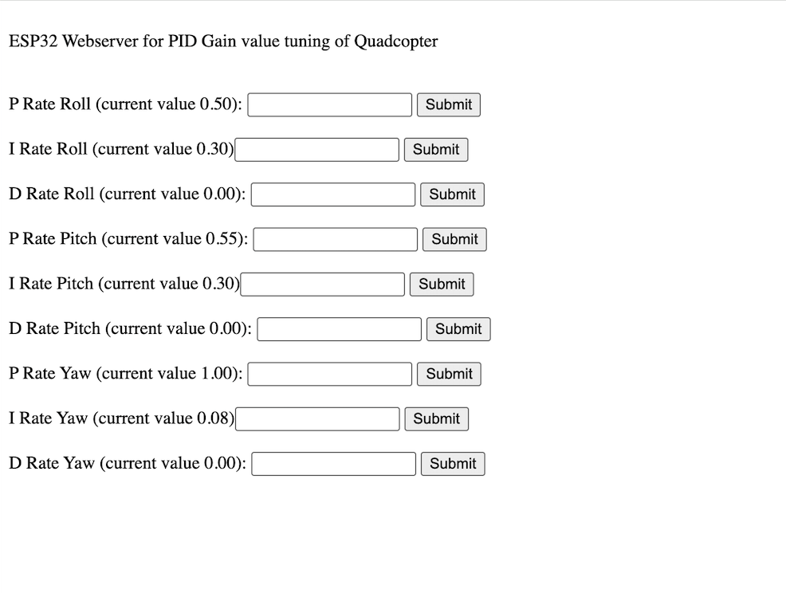
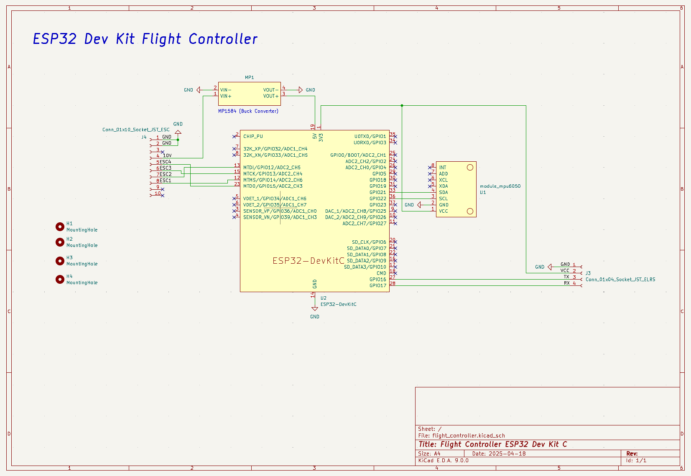
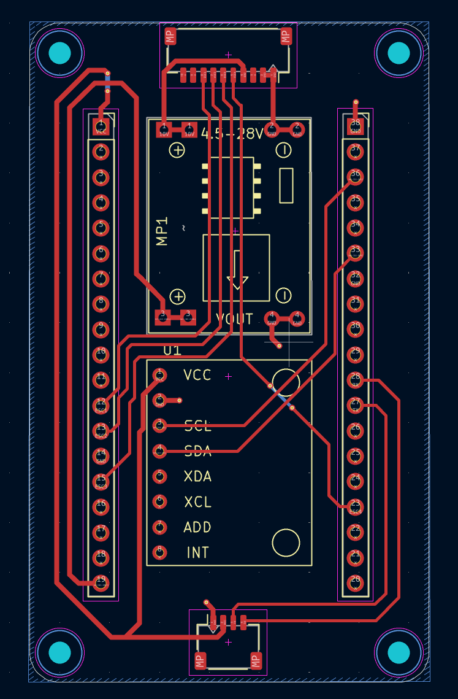
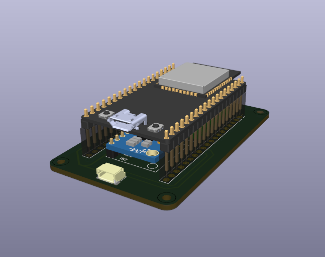
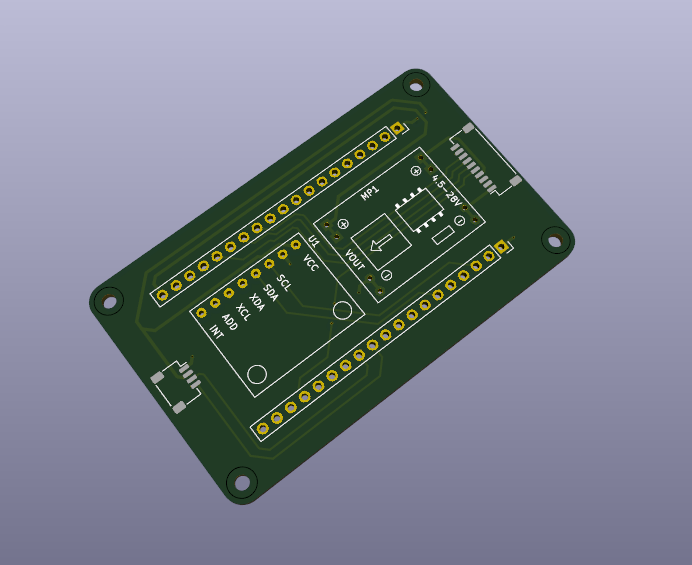
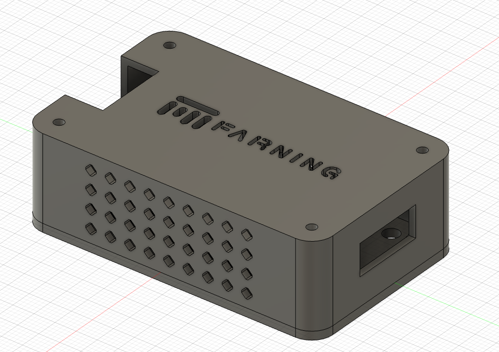
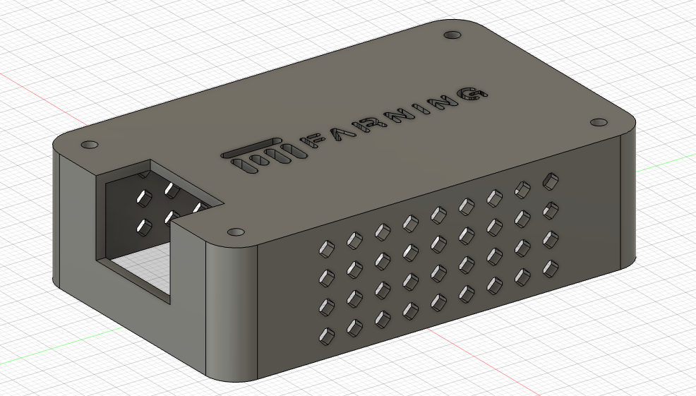
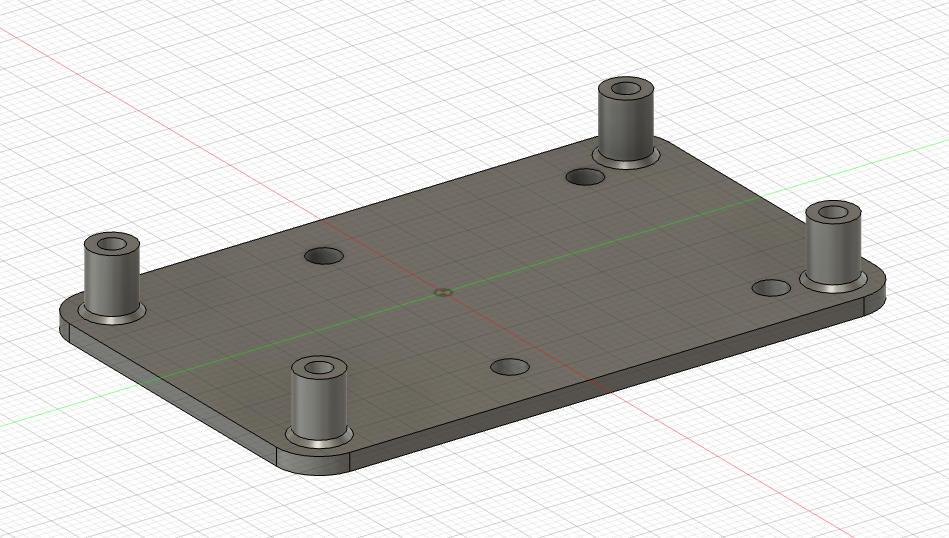
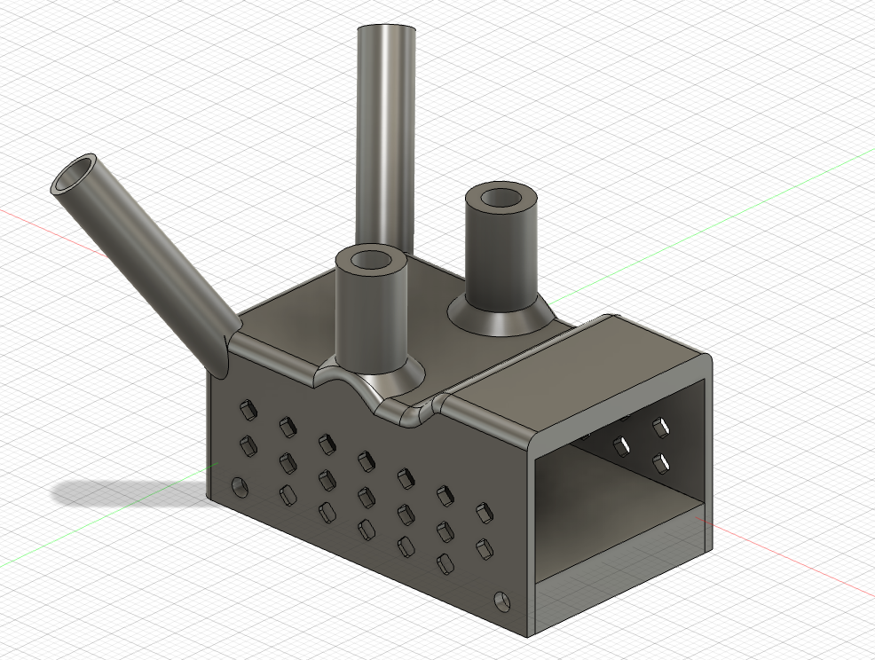

# ESP32 Custom Drone

## 🚁 Overview

A compact, custom-built **5.5″ quadcopter drone** powered by an **ESP32 microcontroller**. This project includes both hardware design (3D-printed components, PCB layout) and firmware (Arduino-based) for flight control.

---

## 🔧 Firmware

The flight control software is written in **C++** using the **Arduino framework**. It runs a **250Hz control loop** to maintain drone stability using the following key features:

- **Sensor Fusion**: A **Kalman Filter** fuses gyroscope and accelerometer data to estimate orientation.
- **Control System**: Stabilization is achieved using a **cascaded PID control loop**.
- **Remote Input**: Directional control is handled via a **radio receiver**.
- **Live PID Tuning**: The drone can host a **local Wi-Fi web interface** for real-time PID tuning.
  > _The web-based tuning interface was adapted from [pratikPhadte/ESP32-Flight-controller-](https://github.com/pratikPhadte/ESP32-Flight-controller-)._

---

## 🛠️ Hardware Components

| Component             | Description                                                | Price   |
| --------------------- | ---------------------------------------------------------- | ------- |
| **Frame**             | FlyFishRC FIFTY5                                           | €50.00  |
| **Radio Receiver**    | Flysky FS-IA6B                                             | €20.00  |
| **Flight Controller** | ESP32-DevKitC, MP1584 (Buck Converter), MPU6050 (IMU), PCB | €20.00  |
| **Motors**            | 4x FlyfishRC Flash 2306 1750Kv                             | €60.00  |
| **ESC**               | 30.5mm 4-in-1 40A BLHeli32                                 | €50.00  |
| **Battery**           | 3S 1500mAh LiPo                                            | €20.00  |
| **Propellers**        | 4x 5.5″ Props                                              | €2.50   |
| **3D Printed Parts**  | Material cost for FC Case, RC Case, Feet                   | €2.00   |
| **Total**             |                                                            | €224,50 |

> Note: The listed prices are approximate and may vary depending on the retailer or manufacturer. In this build, we intentionally used some higher-quality (and more expensive) components to ensure that budget parts wouldn't become a limiting factor in performance. However, with careful sourcing and smart purchasing decisions, the overall cost of this drone can be significantly reduced.

---

## 🧠 Flight Controller

The flight controller (FC) is based on an **ESP32 DevKitC**, mounted on a custom PCB. It integrates:

- **MPU6050 IMU** for motion sensing
- **MP1584 buck converter** to step down 10V (from ESC) to 5V

Connections are made via **JST SH cables** to the ESC and radio receiver.

> ‼️ The VCC wire of the JST SH connector for the radio receiver is connected to the ESP32’s 3.3V output. However, the receiver used in this project (FS-IA6B) requires a minimum operating voltage of 4.0V. To address this, an additional VCC wire was manually soldered to the ESP32’s 5V pin to provide sufficient power. While some 5V receivers may appear to function at 3.3V in test setups, our testing showed that the receiver's output becomes unstable when the motors are running, likely due to temporary voltage drops. For reliable performance, ensure the receiver is properly powered with a stable 5V supply.

---

## 🧾 PCB Design

Designed using **KiCad** and manufactured by **JLCPCB**.

### 🔌 Schematic

### 🔄 Routing

### 3D Model

---

## 🖨️ 3D Printed Parts

All parts were designed in **Autodesk Fusion 360** and printed using **PLA**. **M2/M3 threaded heat inserts** are used to mount components to the carbon frame.

### 📦 Flight Controller Case

### 📡 Radio Receiver Case

### 🧩 Miscellaneous Parts

**Spacers**  

**Feet**  
Model from [Cults3D – FlyFishRC Volador Arm Protection](https://cults3d.com/de/modell-3d/spiel/flyfishrc-volador-5-6-full-arm-protection)  

---

## 👥 Contributors

- Tilman Kurmayer (https://github.com/tchello45)
- Melina Leitermann (https://github.com/me1ina1)

## 📚 References & Inspirations

This project was inspired and guided by the following open-source resources:

- [CarbonAeronautics/Manual-Quadcopter-Drone](https://github.com/CarbonAeronautics/Manual-Quadcopter-Drone)
- [pratikPhadte/ESP32-Flight-controller-](https://github.com/pratikPhadte/ESP32-Flight-controller-)
